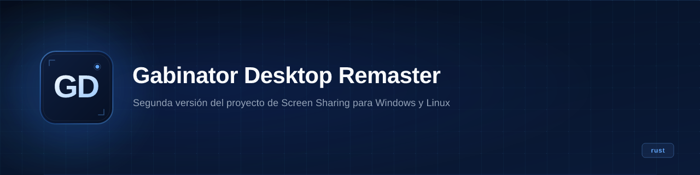

<p align="center">
  
</p>

<h1 align="center">Gabinator Desktop Remaster</h1>

<p align="center"><b>Rust screen-capture server that streams your desktop to an Android device over USB (AOA) or TCP.</b></p>

<p align="center">
  
  
  
  
</p>

---

## What it is

Gabinator Desktop Remaster captures the desktop screen on Windows or Linux, compresses it to JPEG, and sends it to a connected Android device. Two transport modes:

- **AOA mode** — USB via Android Open Accessory protocol. The PC acts as an accessory, discovers the device, and streams frames over a bulk endpoint.
- **TCP mode** — opens a TCP listener on `0.0.0.0:3000` and streams JPEG frames to any connected client.

**In one sentence:** A screen-sharing server that mirrors your desktop to an Android phone over USB or Wi-Fi, built in Rust.

## State

| | |
|---|---|
| **State** | prototype |
| **Last activity** | 2025-05 (code), 2024-11 (core features) |
| **Can you use it today** | No — requires a compatible Android device with AOA support, no tests, no error recovery |
| **What's missing** | Graceful error handling, reconnection logic, tests, CI build on non-Ubuntu, documentation for Android-side client |
| **Risks / known debt** | Unsafe code in Windows capture, debug leftovers (`test_server`, `amongas.jpg`), no LICENSE file |

## Why it exists

This is a university project (EEST N°1 "De la Salle", Buenos Aires) — second iteration of a screen-sharing tool. The goal is to mirror a PC desktop to an Android phone via USB without needing network setup. AOA was chosen because it works over plain USB without drivers on the phone side.

## Stack

- **Language / runtime:** Rust 2021
- **Screen capture:** Windows GDI (`windows` crate) on Windows, xcb (X11) on Linux
- **JPEG compression:** turbojpeg
- **USB communication:** rusb (AOA protocol)
- **Network:** std TcpListener / TcpStream
- **Config:** `config` crate (TOML file)
- **Other:** sysinfo, chrono, ctrlc, byteorder, image, local-ip-address

## Architecture

```
capture_screen()  ──>  jpeg bytes
       │
       ├──> USB (AOA bulk endpoint)  ──>  Android device
       │
       └──> TCP server (:3000)       ──>  Any TCP client
```

- `main.rs` — CLI argument parser, dispatches to USB or TCP mode
- `capture.rs` — platform-specific screen capture (GDI on Windows, xcb on Linux), returns JPEG bytes
- `usb.rs` — AOA device discovery, initialization, bulk transfer loop
- `tcp.rs` — TCP server that captures and streams frames
- `mod_aoa.rs` — AOA protocol constants (USB vendor/product IDs, control requests)
- `error.rs` — Logger and custom error/result types (file + stdout logging, config-driven)

## Repo structure

```
src/
  main.rs         # CLI entry point, argument parsing
  capture.rs      # Screen capture (Windows GDI / Linux xcb) + JPEG encode
  usb.rs          # AOA discovery, init, bulk transfer
  tcp.rs          # TCP streaming server
  mod_aoa.rs      # AOA protocol constants
  error.rs        # Logger, GabinatorError, GabinatorResult
docs/
  overview.md     # Auto-generated overview
gabinator_config.toml  # Logging config (TOML)
Cargo.toml        # Dependencies
```

## How to run

Requirements: Rust 2021+, libxcb-dev (Linux), or Windows SDK (Windows).

```bash
cargo build --release
```

AOA mode (requires Android device with AOA support connected via USB):

```bash
# List compatible AOA devices
./target/release/gabinator_desktop_r -G

# Connect (vendor/product ID from -G output)
./target/release/gabinator_desktop_r -M AOA -V <VID> -P <PID> -C
```

TCP mode (streams to any client on port 3000):

```bash
./target/release/gabinator_desktop_r -M TCP -C
```

Options:

```
-G / --get-devices    List AOA-compatible devices
-V / --vendor-id      USB vendor ID
-P / --product-id     USB product ID
-M / --mode           AOA or TCP
-Q / --quality        JPEG quality (1-100, default 25)
-v / --verbose        Enable debug output
-C / --connect        Start the server
-h / --help           Print help
```

## Roadmap

- [ ] Graceful disconnection and reconnection
- [ ] Configurable TCP port
- [ ] Android client app
- [ ] Multi-monitor support
- [ ] Proper error propagation (remove unwrap/expect)
- [x] Basic AOA screen streaming
- [x] TCP screen streaming
- [x] Cross-platform capture (Windows + Linux)

## Notes

- The `test_server` function in `tcp.rs` writes files named `amongas*.jpg` — debug leftover, not production code.
- AOA initialization uses hardcoded Google vendor ID (`0x18D1`) and standard AOA product IDs (`0x2D00`/`0x2D01`).
- The `capture_screen` function uses `unsafe` on Windows due to GDI API requirements.
- No tests exist. CI runs `cargo test` but the test suite is empty.
- The last real code change was May 2025 (gitignore fix); core features were written in November 2024.

## License

No license file. Not open source — visible only.
